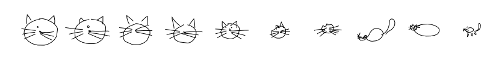
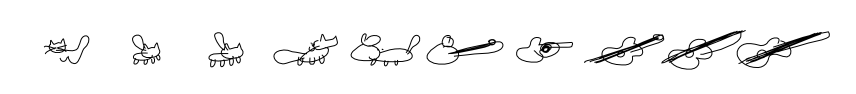
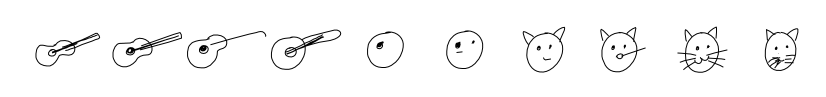

# A Keras Implementation of Sketch-RNN
 

In this repo there's a Kares implementation of the Sketch-RNN algorithm,   
as described in the paper [A Neural Representation of Sketch Drawings](https://arxiv.org/pdf/1704.03477.pdf) by David Ha and Douglas Eck (Google AI).


The implementation is ported from the [official Tensorflow implementation](https://github.com/tensorflow/magenta/tree/master/magenta/models/sketch_rnn) that was released under project [Magenta](https://magenta.tensorflow.org/) by the authors.


## Overview
Sketch-RNN consists of a Sequence to Sequence Variational Autoencoder (Seq2SeqVAE), which is able to encode a series of pen strokes (a sketch) into a latent space, using a bidirectional LSTM as the encoder. The latent representation can then be decoded back into a series of strokes.  
The model is trained to reconstruct the original stroke sequences while maintaining a normal distribution across latent space elements. Since encoding is performed stochastically, and so is the sampling mechanism of the decoder, the reconstructed sketches are always different.  
This allows to let a trained model draw new and unique sketches that it has not seen before. Designing the model as a variational autoencoder also allows to perform latent space manipulations to get interesting interpolations between different sketches.


There's no need to elaborate on the specifics of the algorithm, since many great resources exist for this end.  
I recommend David Ha's blog post [Teaching Machines to Draw](https://ai.googleblog.com/2017/04/teaching-machines-to-draw.html).

### Implementation Details
You can find in this repo some useful solutions for common pitfalls when porting from TF to Keras (and writing Keras in general), for example:
  * Injecting values to intermediate tensors and predicting the corresponding values of other tensors by building sub-models 
  * Using custom generators to wrap data loader classes
  * Using an auxiliary loss term that uses intermediate layers' outputs rather than the model's predictions
  * Using a CuDNN LSTM layer, while allowing inference on CPU
  * Resuming a training process from a checkpoint in the case that custom callbacks are used with dynamic internal variables


### Dependencies
Tested in the following environment:
  * Keras 2.2.4 (Tensorflow 1.11 backend)
  * Python 3.5
  * Windows OS

Hopefully, soon I will update with minimum requirements

## Usage

### Training
To train a model, you need a dataset in the appropriate format. You can download one of many prepared sketches datasets that were [released by Google](https://console.cloud.google.com/storage/browser/quickdraw_dataset/sketchrnn). Simply download one or more `.npz` files and save them in the same directory (recommended to use a `datasets` directory within the project's main directory).

##### Example usage:
`python seq2seqVAE_train --data_dir=datasets --data_set=cat --experiment_dir=\sketch_rnn\experiments`

Currently, configurable hyperparameters can only be modified by changing their default values in `seq2seqVAE.py`.  
I might add an option to configure them via command line in the future.

You can also resume the training from a saved checkpoint by supplying the `--checkpoint=[file path]` and a `--initial_epoch=[epoch from which you are restarting]` arguments.  

The full list of configurable parameters:
```python
        # Experiment Params:
        'is_training': True,           # train mode (relevant only for accelerated LSTM mode)
        'data_set': 'cat',             # datasets to train on
        'epochs': 50,                  # how many times to go over the full train set (on average, since batches are drawn randomly)
        'save_every': None,            # Batches between checkpoints creation and validation set evaluation. Once an epoch if None.
        'batch_size': 100,             # Minibatch size. Recommend leaving at 100.
        'accelerate_LSTM': False,      # Flag for using CuDNNLSTM layer, gpu + tf backend only
        # Loss Params:    
        'optimizer': 'adam',           # adam or sgd
        'learning_rate': 0.001,    
        'decay_rate': 0.9999,          # Learning rate decay per minibatch.
        'min_learning_rate': .00001,   # Minimum learning rate.
        'kl_tolerance': 0.2,           # Level of KL loss at which to stop optimizing for KL.
        'kl_weight': 0.5,              # KL weight of loss equation. Recommend 0.5 or 1.0.
        'kl_weight_start': 0.01,       # KL start weight when annealing.
        'kl_decay_rate': 0.99995,      # KL annealing decay rate per minibatch.
        'grad_clip': 1.0,              # Gradient clipping. Recommend leaving at 1.0.
        # Architecture Params:
        'z_size': 128,                 # Size of latent vector z. Recommended 32, 64 or 128.
        'enc_rnn_size': 256,           # Units in encoder RNN.
        'dec_rnn_size': 512,           # Units in decoder RNN.
        'use_recurrent_dropout': True, # Dropout with memory loss. Recommended
        'recurrent_dropout_prob': 0.9, # Probability of recurrent dropout keep.
        'num_mixture': 20,             # Number of mixtures in Gaussian mixture model.
        # Data pre-processing Params:
        'random_scale_factor': 0.15,   # Random scaling data augmentation proportion.
        'augment_stroke_prob': 0.10    # Point dropping augmentation proportion.
```

### Using a trained model to draw


In the notebook `Skecth_RNN_Keras.ipynb` you can supply a path to a trained model and a dataset and explore what the model has learned.
There are examples of encoding and decoding of sketches, interpolating in latent space, sampling under different `temperature` values etc.  
You can also load models trained on multiple data-sets and generate nifty interpolations such as these guitar-cats!



Examples in this notebook use models trained on my laptop's GPU:
  * Cat model : 50 epochs
  * Cat + Guitar model: 15 epochs

Both pre trained models are included in this repo.

#### References
  - The guitar animation was created using [this tutorial](https://colab.research.google.com/github/zaidalyafeai/Notebooks/blob/master/Strokes_QuickDraw.ipynb)
